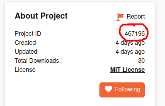
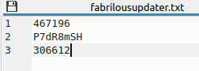

# Fabrilous Updater
Minecraft server-side (works in singleplayer!) mod used to check for updates to your Fabric mods.

Note: Only works with mods uploaded to CurseForge.

## How to use?

Place the mod in your mods folder and make sure you run it once. Then, open the "fabrilousupdater.txt" file found in your config folder. Open the CurseForge page for the mod you want to check for updates. Copy the mod's Project ID and paste it into "fabrilousupdater.txt" one line at a time (See photos). That's it!

## Commands
* "/fabdate update" - Shows a list of mods needing updates with an easy click download link.
* "/fabdate list" - Shows a list of all mods in the "fabrilousupdater.txt" file.

 (3 mods addedz)